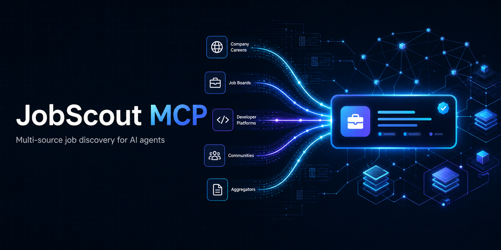

# JobScout MCP



[](https://github.com/SarutobiSasuke8/jobscout-mcp/actions/workflows/ci.yml)
[](LICENSE)
[](package.json)

A privacy-first, bring-your-own-connections MCP server for multi-source job discovery. JobScout gives AI agents one normalized pool with provenance, deterministic deduplication, and specialist AI/Web3 signals.

JobScout deliberately stops at trustworthy discovery. It does not store CVs, rank candidates, contact employers, or apply to jobs.

## Why JobScout

- Search enabled providers without making one source the whole market.
- Keep discovery provenance separate from canonical employer application routes.
- Continue with partial results when an individual provider fails.
- Enforce remote and freshness filters after provider retrieval.
- Disclose which constraints a provider could not apply, rather than returning an unscoped result as though it answered the question.
- Classify AI, agentic and Web3 signals locally and deterministically.
- Keep candidate identity and career policy in a private client such as Career OS.

## MCP tools

| Tool | Purpose | Network |
|---|---|---|
| `jobscout_list_sources` | Show configured providers, transports and coverage | No |
| `jobscout_search_jobs` | Search, normalize, filter and deduplicate enabled sources | Provider-dependent |
| `jobscout_classify_jobs` | Detect AI, agentic and Web3 signals in supplied jobs | No |
| `jobscout_deduplicate` | Normalize and merge supplied JobScout records | No |
| `jobscout_briefing` | Project records into briefing-ready entries with a compact `one_line` and best link | No |
| `jobscout_source_yield` | Report what each source contributed: unique finds, overlap, employer-route coverage, undated records, conflicts | No |

Two MCP prompts guide first-run use without the server storing anything: `jobscout_setup` walks through enabling providers and what each one contacts; `jobscout_find_jobs` gathers role, location and remote preference per search. A search run with zero enabled providers returns `setup_required: true` with guidance instead of a misleading empty result, and results report `providers_disabled`, `records_rejected` (with a `records_rejected_by_provider` breakdown), `undated_records`, `location_unfiltered` and `warnings` so thin results are always explained. `require_dated` and `include_descriptions` let a caller trade recall for certainty, or drop the untrusted description text it does not need.

## Quick start

Node.js 22.13 or newer is required.

```bash
npm exec --yes --package=@sarutobi-sasuke/jobscout-mcp -- jobscout-mcp
```

Codex example with the public Himalayas adapter enabled:

```bash
codex mcp add jobscout --env JOBSCOUT_ENABLE_HIMALAYAS=true -- npm exec --yes --package=@sarutobi-sasuke/jobscout-mcp -- jobscout-mcp
```

MCP hosts can also run the package straight from GitHub, which is useful for pinning to a commit or testing an unreleased branch:

```bash
npm exec --yes --package=github:SarutobiSasuke8/jobscout-mcp -- jobscout-mcp
```

See [installation](docs/INSTALLATION.md) for Claude Desktop, Cursor, local development, JobSpy, and troubleshooting.

## Install in ChatGPT, Codex and Claude

JobScout runs two ways: locally over stdio (works today), or as a hosted Streamable HTTP server (code and package ready, not yet deployed).

### Local, works today

- **Codex:** `codex mcp add jobscout --env JOBSCOUT_ENABLE_HIMALAYAS=true -- npm exec --yes --package=@sarutobi-sasuke/jobscout-mcp -- jobscout-mcp`
- **Claude Code:** `claude mcp add jobscout --env JOBSCOUT_ENABLE_HIMALAYAS=true -- npm exec --yes --package=@sarutobi-sasuke/jobscout-mcp -- jobscout-mcp`
- **Claude Desktop, Cursor and other JSON hosts:** see [installation](docs/INSTALLATION.md).

### ChatGPT and Codex plugin (JobScout Discover)

The directory package is in [`plugins/jobscout-discover`](plugins/jobscout-discover) and follows [OpenAI's plugin format](https://developers.openai.com/plugins/build/plugins). It is **not yet listed**: it needs a public HTTPS deployment, OAuth for existing-account sign-in, a demo account and a portal submission. Everything else is drafted. See [JobScout Discover](docs/discover/README.md) for the review materials and the full list of gaps, and [deployment](docs/DEPLOYMENT.md) for the hosted server.

Once a deployment URL exists, a ChatGPT developer-mode connector or a Claude custom connector can point at its `/mcp` endpoint, and Claude Code can use `claude mcp add --transport http jobscout <url>`. Until then, use the local install above.

Plans are sold only on the operator's own site. There is no in-chat checkout. See [monetisation](docs/MONETISATION.md).

## Providers

Providers are disabled by default and failures are isolated.

| Provider | Transport | Authentication | Notes |
|---|---|---|---|
| Himalayas | Remote MCP | Optional | Public job search; employer route should still be verified |
| We Work Remotely | Public RSS feed | None | No keyword search endpoint; results filtered client-side |
| RemoteOK | Public JSON endpoint | None | Latest-listings feed filtered client-side; attribution requested by its API terms |
| Lenny's Job Board | HTTP search API | None | Product, growth, design and engineering roles via TrueUp's undocumented endpoint; board links are discovery URLs |
| JobSpy | Local Python subprocess | None | Optional `python-jobspy`; availability and site terms vary |
| Greenhouse, Ashby, Lever | Official public job-board APIs | None | Opt-in per listed company board; the employer's ATS requisition URL is canonical |

The provider contract supports future official ATS and specialist job-board adapters without coupling the core to any one vendor. See [provider documentation](docs/PROVIDERS.md).

## AI and Web3 intelligence

Every normalized job can include deterministic `signals` covering AI agents, inference, evals, safety, Web3 protocols, DeFi, DePIN, wallets, exchanges, developer infrastructure, gaming, and agentic commerce. Technology detection currently includes MCP, A2A, x402, LLMs, RAG, Ethereum, Base, and Solana.

These are inspectable discovery signals, not opaque candidate scores. See [job intelligence](docs/JOB_INTELLIGENCE.md).

## Optional agent operating guide

[`agents/jobscout-operator.md`](agents/jobscout-operator.md) gives an MCP-capable agent a safe, reusable discovery workflow and output contract. It is intentionally one functional operator—not a bundled fictional team—and contains no private candidate profile or Career OS policy.

## Trust and safety

- Provider responses are untrusted and schema-validated.
- Only HTTP(S) job URLs are accepted.
- Remote and subprocess outputs have explicit size and time limits.
- JobSpy is spawned without a shell and receives typed JSON over stdin.
- No auto-apply, login automation, CAPTCHA bypass, credential capture, or proxy evasion.
- Users remain responsible for provider terms, job freshness, location eligibility, and employer-route verification.

Read [SECURITY.md](SECURITY.md) before enabling third-party providers.

## Development

```bash
npm install
cp .env.example .env
npm run check
npm run smoke:mcp
npm run check:plugin
```

The protocol smoke test uses the official MCP Inspector. Provider contributions must include fixtures, failure behavior, provenance handling, and tests; see [CONTRIBUTING.md](CONTRIBUTING.md).

## Release status

The next release includes more conservative duplicate handling and streaming feed-size limits. See [reliability evidence and remaining gates](docs/RELIABILITY.md). These changes are unreleased until a new version is tagged and published.

Live on npm as [`@sarutobi-sasuke/jobscout-mcp`](https://www.npmjs.com/package/@sarutobi-sasuke/jobscout-mcp) and on the official MCP Registry as `io.github.SarutobiSasuke8/jobscout-mcp`. Releases are tagged `vX.Y.Z` on GitHub; CI publishes to npm with provenance. See [RELEASING.md](RELEASING.md) for the release process and rollback order.

## Prior art and licence

[JobSpy](https://github.com/speedyapply/JobSpy) is used as an optional MIT-licensed dependency rather than copied. [borgius/jobspy-mcp-server](https://github.com/borgius/jobspy-mcp-server) demonstrated demand for a JobSpy MCP wrapper; no source from it is copied here.

JobScout MCP is Apache-2.0 licensed. Third-party dependencies retain their own licences.
